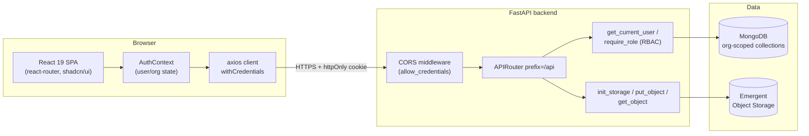
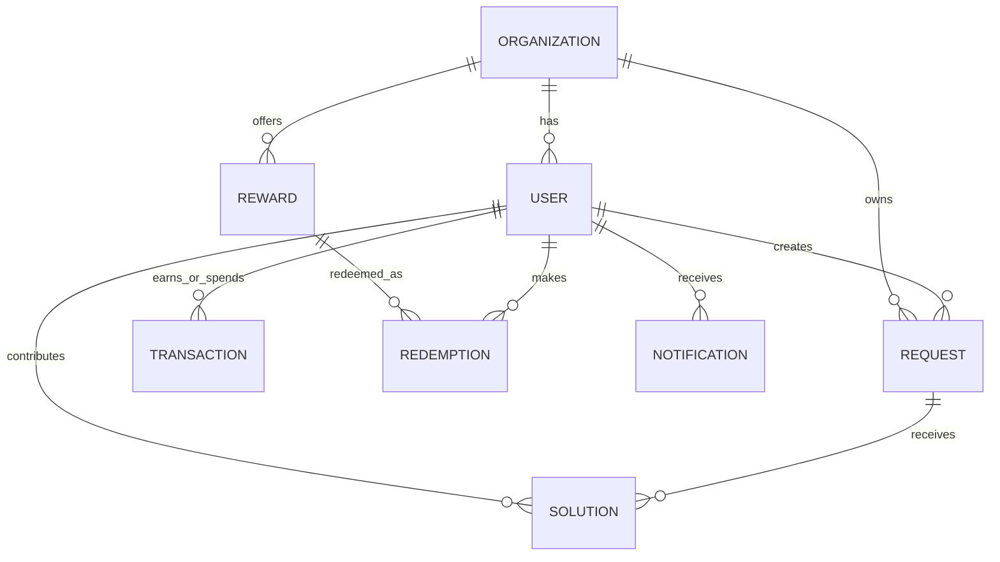
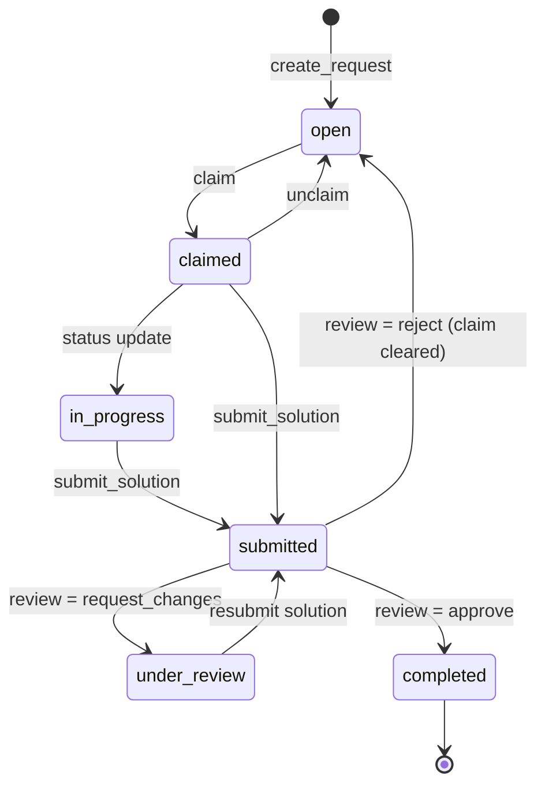
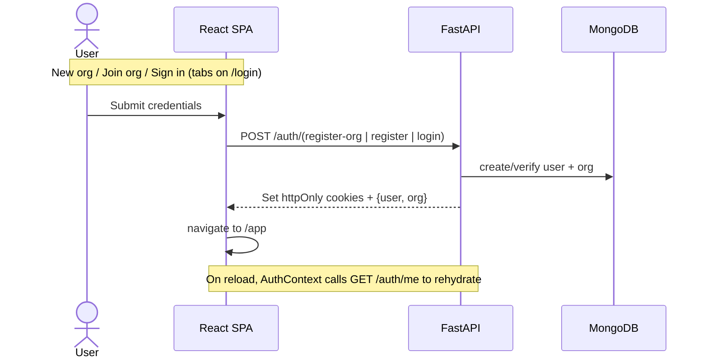
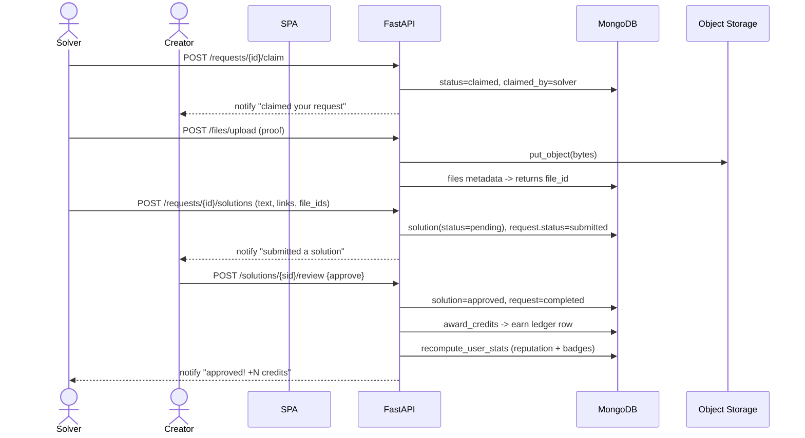

# HiveMind — High-Level Design & User Flow

> Internal organizational problem marketplace & contribution economy.
> Employees post problems (intros, hiring, research, vendor discovery, market intel, mentorship), peers claim and solve them, submit proof-of-work, and earn credits redeemable for rewards — with reputation, badges, leaderboards, a kanban board, dashboards, multi-tenant orgs, RBAC, audit logs, and notifications.

---

## 1. Overview

HiveMind turns the quiet, distributed expertise inside an organization into a measurable internal economy. Anyone can post a "request" (a problem or ask) with a credit bounty; colleagues claim it, do the work, attach proof, and get the bounty once a reviewer approves. Contribution is tracked via credits, reputation, and tiered badges.

### Personas

| Persona | Responsibilities |
| --- | --- |
| **Admin** | Owns the org. Manages users, roles, categories, departments, credit valuation, rewards; views audit logs. |
| **Manager** | Monitors team activity, sees audit logs, can edit/transition any request. |
| **Reviewer** | Approves / rejects / requests changes on submitted solutions. |
| **Employee** | Creates and claims requests, submits solutions, earns credits, redeems rewards. |

All data is scoped to a single tenant (`org_id`), so multiple organizations are fully isolated within one deployment.

---

## 2. Tech Stack

| Layer | Technology |
| --- | --- |
| **Backend** | FastAPI (single-file MVP in [`backend/server.py`](backend/server.py)), `APIRouter` mounted at `/api` |
| **Database** | MongoDB via Motor (`AsyncIOMotorClient`) |
| **Auth** | JWT (`HS256`) in **httpOnly** cookies (`access_token` 1 day, `refresh_token` 7 days), `samesite=none; secure` |
| **Object storage** | Emergent Object Storage (init via `EMERGENT_LLM_KEY`) for proof-of-work file uploads |
| **Frontend** | React 19, react-router-dom 7, Tailwind + shadcn/ui (Radix), Recharts, axios, sonner toasts |
| **Build** | CRACO (Create React App + config override), Yarn |

Key backend dependencies: `motor`, `pydantic`, `pyjwt`, `bcrypt`, `python-multipart`, `requests` (see [`backend/requirements.txt`](backend/requirements.txt)).

---

## 3. High-Level Architecture



- The SPA talks only to `/api/*`. The axios instance ([`frontend/src/lib/api.js`](frontend/src/lib/api.js)) sets `withCredentials: true` so the JWT cookie travels on every request.
- Every protected endpoint resolves the caller via `get_current_user` (decodes the cookie/Bearer JWT, loads the user). Admin/manager-only endpoints add `require_role(...)`.
- **Multi-tenancy:** every query filters on `org_id` taken from the authenticated user, so tenants never see each other's data.

---

## 4. Data Model

MongoDB collections (created/seeded in [`backend/server.py`](backend/server.py)). IDs are UUID strings (`new_id()`); timestamps are ISO-8601 UTC (`now_iso()`).

| Collection | Key fields | Notes |
| --- | --- | --- |
| `organizations` | `id`, `name`, `domain` (unique), `credit_value_inr`, `categories[]`, `departments[]` | One per tenant. |
| `users` | `id`, `org_id`, `email` (unique), `password_hash`, `role`, `department`, `designation`, `skills[]`, `expertise_tags[]`, `reputation_score`, `credits_earned`, `credits_redeemed`, `badges[]` | `credits_balance = earned - redeemed` (computed in `public_user`). |
| `requests_col` | `id`, `org_id`, `creator_id`, `title`, `description`, `category`, `tags[]`, `difficulty`, `bounty_credits`, `status`, `claimed_by`, `claimed_at`, `completed_at`, `view_count` | The core "problem" entity. |
| `solutions` | `id`, `request_id`, `org_id`, `contributor_id`, `submission_text`, `links[]`, `file_ids[]`, `status` (pending/approved/rejected/changes_requested), `feedback`, `reviewed_by` | Proof-of-work submissions. |
| `transactions` | `id`, `org_id`, `source_user`, `destination_user`, `credits`, `transaction_type` (earn/redeem), `reason`, `request_id`, `timestamp` | Immutable credit ledger. |
| `rewards` | `id`, `org_id`, `name`, `credits`, `image`, `stock`, `active` | 8 defaults seeded per org. |
| `redemptions` | `id`, `org_id`, `user_id`, `reward_id`, `reward_name`, `credits`, `status` | Redemption history. |
| `notifications` | `id`, `org_id`, `user_id`, `message`, `link`, `read`, `timestamp` | In-app bell feed. |
| `audit_logs` | `id`, `org_id`, `actor_id`, `action`, `target`, `meta`, `timestamp` | Admin/manager visibility. |
| `files` | `id`, `org_id`, `uploader_id`, `storage_path`, `original_filename`, `content_type`, `size`, `is_deleted` | Metadata; bytes live in object storage. |

### Relationships



### Indexes (created on startup)

`users.email` (unique), `users.org_id`, `organizations.domain` (unique), `requests_col(org_id, status)`, `requests_col(org_id, created_at desc)`, `solutions.request_id`, `transactions(org_id, destination_user)`, `notifications(user_id, timestamp desc)`, `files.id` (unique).

---

## 5. Backend Modules / API Surface

All routes are under `/api`. Auth is required unless noted. RBAC enforced via `require_role(...)`.

### Auth
| Method & Path | Purpose |
| --- | --- |
| `POST /auth/register-org` | Create a new org + admin user; seeds categories/departments/rewards; sets cookies. (public) |
| `POST /auth/register` | Join an existing org by domain as an `employee`; sets cookies. (public) |
| `POST /auth/login` | Email/password login; sets cookies. (public) |
| `POST /auth/logout` | Clear auth cookies. |
| `GET /auth/me` | Current user + org (used to rehydrate session). |
| `POST /auth/refresh` | Mint a new access token from the refresh cookie. |

### Org & Users
| Method & Path | Purpose |
| --- | --- |
| `GET /org`, `PATCH /org` | Read / update org settings (PATCH = admin). |
| `GET/POST /org/categories`, `GET /org/departments` | Manage taxonomy (POST = admin). |
| `GET /users`, `GET /users/{id}`, `GET /users/me` | Directory & profiles (search by name/email/skills). |
| `PATCH /users/me` | Update own profile (skills, designation, avatar…). |
| `PATCH /users/{id}/role` | Change a user's role (admin only). |

### Requests & Solutions
| Method & Path | Purpose |
| --- | --- |
| `GET /requests` | List with filters: `status`, `category`, `department`, `q`, `creator_id`, `claimed_by`; decorated with creator/claimer. |
| `POST /requests` | Create a request (status `open`). |
| `GET /requests/{id}` | Detail incl. solutions + contributors; increments `view_count`. |
| `PATCH /requests/{id}` | Edit (creator or admin/manager). |
| `POST /requests/{id}/claim` / `unclaim` | Claim/release a request (can't claim own). |
| `POST /requests/{id}/status` | Manual status transition (creator/claimer/admin/manager). |
| `POST /requests/{id}/solutions` | Submit a solution → request becomes `submitted`. |
| `POST /solutions/{id}/review` | Approve / reject / request_changes (creator or reviewer/admin/manager). |

### Files, Rewards, Ledger, Insights
| Method & Path | Purpose |
| --- | --- |
| `POST /files/upload`, `GET /files/{id}/download` | Upload (≤15 MB) / stream download (supports `?auth=` token for ``). |
| `GET /rewards`, `POST /rewards`, `POST /rewards/redeem`, `GET /redemptions` | Marketplace + redemption (POST reward = admin). |
| `GET /transactions/me` | Personal credit ledger. |
| `GET /leaderboard` | Ranking by `scope` (global/department) and `period` (all/monthly/quarterly). |
| `GET /dashboard/stats` | KPI cards, 14-day activity, category breakdown, personal stats. |
| `GET /notifications`, `POST /notifications/{id}/read`, `POST /notifications/read-all` | In-app notifications. |
| `GET /audit-logs` | Audit trail (admin/manager). |
| `GET /health` | Liveness probe. |

---

## 6. Domain Logic

### Request lifecycle



- **Claiming** is only allowed from `open`, and a creator cannot claim their own request.
- **Submitting** a solution flips the request to `submitted` and notifies the creator.
- **Review actions** (`POST /solutions/{id}/review`):
  - `approve` → request `completed`, bounty paid to contributor via `award_credits`, reputation/badges recomputed, contributor notified.
  - `reject` → request reopened (`open`, claim cleared), contributor notified.
  - `request_changes` → request `under_review`, contributor notified to revise.

### Credits & reputation

- **Award credits** (`award_credits`): increments the contributor's `credits_earned` and writes an `earn` row to the `transactions` ledger.
- **Redeem**: balance check (`credits_earned - credits_redeemed`), decrements stock, records a `redemption` + a `redeem` ledger row.
- **Reputation** (`compute_reputation`):

```
reputation = credits_earned*0.5 + solved*25 + success_rate*2 + avg_rating*10
```

- **Badges** (`BADGE_DEFS`) auto-awarded in `recompute_user_stats` across tiers **Bronze → Silver → Gold → Platinum → Diamond**:
  - `problem_solver` (by # solved), `connector` (proxy of solved), `top_contributor` (by credits earned).

---

## 7. Frontend Structure

Routing in [`frontend/src/App.js`](frontend/src/App.js):

| Route | Page | Access |
| --- | --- | --- |
| `/` | Landing | public |
| `/login` | Login (Sign in / Join org / New org tabs) | public (redirects to `/app` if authed) |
| `/app` | Dashboard | protected |
| `/app/board` | Board (kanban pipeline) | protected |
| `/app/requests/new` | NewRequest | protected |
| `/app/requests/:id` | RequestDetail | protected |
| `/app/leaderboard` | Leaderboard | protected |
| `/app/rewards` | Rewards | protected |
| `/app/profile/:id` | Profile | protected |
| `/app/admin` | Admin | admin only (nav hidden otherwise) |

- **Session:** [`AuthContext`](frontend/src/contexts/AuthContext.js) calls `GET /auth/me` on mount to rehydrate `user`/`org` from the cookie, and exposes `login`, `register`, `registerOrg`, `logout`, `refresh`.
- **Guarding:** [`ProtectedRoute`](frontend/src/components/ProtectedRoute.js) shows a loader while auth resolves, then redirects unauthenticated users to `/login`.
- **Shell:** [`AppShell`](frontend/src/components/AppShell.js) renders the glass nav (Dashboard / Board / Leaderboard / Rewards, plus Admin for admins), global search (Enter → `/app/board?q=`), a notifications bell that polls every 30s, and the user/account menu.
- **Board:** [`Board.js`](frontend/src/pages/Board.js) groups requests into kanban columns by status (excluding `rejected`), with search + category filters.
- **Request detail:** [`RequestDetail.js`](frontend/src/pages/RequestDetail.js) drives claim/unclaim, solution submission (text + comma-separated links + file uploads), and the review dialog.

---

## 8. User Flows

### 8.1 Onboarding & authentication



### 8.2 Create a request → it appears on the board

1. User clicks **New Request** (header or board) → `NewRequest` form.
2. `POST /requests` creates it with status `open`, `org_id`, and `creator_id`.
3. It immediately shows in the **Open** column of the Board and in `GET /requests` lists.

### 8.3 Claim → solve → review (the core economy loop)



- **Reject** path: request returns to `open` and `claimed_by` is cleared so others can pick it up.
- **Request changes** path: request moves to `under_review`; the solver revises and resubmits.

### 8.4 Earn → redeem rewards

1. Approved solutions credit the solver (`credits_earned ↑`).
2. In **Rewards**, the user redeems an item via `POST /rewards/redeem`.
3. Backend checks balance & stock, increments `credits_redeemed`, decrements `stock`, writes a `redemption` + a `redeem` ledger entry. History is available via `GET /redemptions`.

### 8.5 Insights & notifications

- **Dashboard** (`GET /dashboard/stats`): org KPIs (total/open/in-progress/completed, credits awarded, active contributors, participation rate), personal stats, a 14-day created-vs-solved activity chart, and top categories.
- **Leaderboard** (`GET /leaderboard`): global or department scope; all-time (by reputation then credits) or monthly/quarterly (by credits earned in the window via transaction aggregation).
- **Notifications**: AppShell polls `GET /notifications` every 30s; bell badge shows unread count; clicking an item navigates to its `link`; "Mark all read" hits `POST /notifications/read-all`.

---

## 9. Security & Multi-Tenancy Notes

- **JWT in httpOnly cookies** (`access_token`, `refresh_token`) — not readable by JS, mitigating XSS token theft; `secure` + `samesite=none` for cross-site preview hosting. `get_current_user` also accepts a `Bearer` header fallback.
- **RBAC** via `require_role(...)` for admin/manager/reviewer-gated endpoints; finer checks inline (e.g., only creator/claimer/admin/manager can transition a request; only creator/reviewer roles can review).
- **Tenant isolation:** every DB query is filtered by the caller's `org_id`; cross-org access is structurally prevented.
- **File access:** downloads require a valid token (cookie or `?auth=` query token for ``), and files are re-checked against `org_id` and `is_deleted`.
- **Password security:** bcrypt hashing (`hash_password` / `verify_password`).

### Known limitations (from PRD)

- Object storage uses the synchronous `requests` library inside async routes — non-blocking for low traffic but should migrate to `httpx` for high concurrency.
- CORS uses `allow_origin_regex=".*"` with credentials for preview convenience — tighten to explicit origins in production.
- Recharts `ResponsiveContainer` emits a cosmetic width/height(-1) warning on first paint.

---

## Appendix — Seed / Demo data

On startup the backend seeds a demo tenant **Acme Corp** (`acme.com`) with 5 users, 8 sample requests (mix of open/claimed/completed), default categories, departments, and 8 rewards.

| Email | Password | Role |
| --- | --- | --- |
| `admin@acme.com` | `Admin@123` | admin |
| `manager@acme.com` | `Manager@123` | manager |
| `reviewer@acme.com` | `Reviewer@123` | reviewer |
| `priya@acme.com` | `Priya@123` | employee |
| `arjun@acme.com` | `Arjun@123` | employee |
